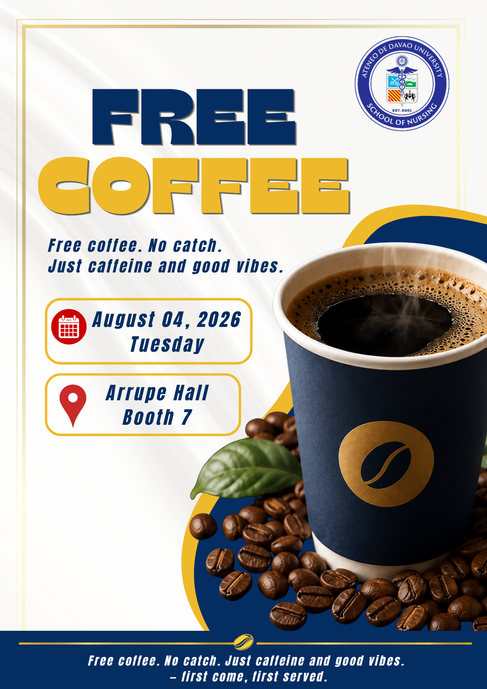

 

# 🎀 PRESENTATION DESIGN PRINCIPLES

### GE 4120 · Presentation Design Portfolio

  

🩷 ─────────── 🎀 ─────────── 💜

 

 

This activity demonstrates the application of **presentation design principles** through a promotional poster created for a **Free Coffee** event. The design combines typography, color, imagery, shapes, spacing, and information placement to create a poster that is eye-catching, organized, and easy to understand.

The main goal of the design was to communicate the event information clearly while creating a visually appealing coffee-themed composition.

 

---

  

### ☕ FREE COFFEE PROMOTIONAL POSTER

 

  

  

*Promotional poster created for a Free Coffee event at Arrupe Hall, Booth 7.*

---

  

🩷 ˚₊‧♡‧₊˚ 💜 ˚₊‧♡‧₊˚ 🩷

 

## 🩷 01 · Visual Hierarchy

I applied **visual hierarchy** by making the words **“FREE COFFEE”** the largest and most noticeable element of the poster. The large typography immediately attracts attention and communicates the main message before the viewer reads the smaller details.

The event date, location, and tagline are given different levels of emphasis so the audience can easily identify the most important information.

 

---

## 💜 02 · Contrast

The poster uses strong **color and size contrast** through the combination of dark navy blue, bright yellow, white, and red accent elements.

The navy and yellow colors create a strong visual difference, especially in the main **“FREE COFFEE”** title. The large coffee cup also contrasts against the lighter background, making the main visual immediately noticeable.

 

---

## 🩷 03 · Balance

I used **balance** by distributing the visual weight between the typography and the coffee imagery.

The large coffee cup and coffee beans occupy the right and lower portions of the poster, while the title and event information are positioned mainly on the left. This creates a balanced composition without making one side feel unnecessarily crowded.

The curved blue and yellow shapes also help connect the different areas of the composition.

 

---

## 💜 04 · Alignment

The poster demonstrates **alignment** through the organized placement of the event information.

The date and location are presented inside structured rounded boxes, creating a consistent visual system. The text, icons, and information blocks follow a clear arrangement that allows the viewer to scan the details easily.

 

---

## 🩷 05 · Proximity

I applied **proximity** by grouping related information together.

The **date and day** are placed in one information box, while the **venue and booth number** are placed in another. This allows viewers to quickly recognize which details belong together.

The coffee cup, coffee beans, and decorative shapes are also visually grouped to strengthen the coffee theme.

 

---

## 💜 06 · Consistency

I maintained **consistency** by repeating the same visual language throughout the poster.

The navy blue and yellow color combination appears in the typography, decorative shapes, borders, and other elements. Rounded information boxes, repeated line details, and consistent typography help the poster feel unified.

The university logo is also positioned consistently at the top-right, providing an identifiable visual element.

 

---

## 🩷 07 · Simplicity

Although the poster contains several visual elements, the information is kept focused on the main purpose of the event.

The design communicates only the essential details:

**FREE COFFEE**  
**August 04, 2026 · Tuesday**  
**Arrupe Hall · Booth 7**

The supporting tagline, **“Free coffee. No catch. Just caffeine and good vibes.”**, adds personality without taking attention away from the main message.

---

  

🎨 ˚₊‧♡‧₊˚ ☕ ˚₊‧♡‧₊˚ 🎨

 

## 🎨 Color Palette

The poster uses a **navy blue and golden yellow** color combination as its primary visual identity.

| Color | Purpose |
|---|---|
| 🔵 **Navy Blue** | Main typography, shapes, and strong visual emphasis |
| 🟡 **Golden Yellow** | Main title, borders, and decorative accents |
| ⚪ **White** | Background and negative space |
| 🔴 **Red** | Information icons for additional emphasis |
| 🟤 **Brown** | Coffee beans and coffee imagery |

The combination creates a warm, energetic, and inviting atmosphere that fits the theme of a coffee promotion.

 

---

 

## ✦ Typography

Typography plays an important role in establishing the visual personality of the poster.

The large, bold display type used for **“FREE COFFEE”** creates immediate attention and gives the poster a strong headline. The italicized supporting text creates contrast with the main title while maintaining the energetic and youthful feel of the design.

Different font sizes and weights help establish a clear reading order from the main message to the supporting event details.

---

  

☕ · 🫘 · 🎀 · 🩷 · 💜

 

## ☕ Imagery

The **coffee cup and coffee beans** serve as the main visual imagery of the poster.

The large coffee cup immediately communicates the theme even before the viewer reads the text. The scattered coffee beans create additional depth and reinforce the coffee concept.

The imagery is positioned mainly on the right and lower portion of the composition, allowing the left side to remain available for the event information.

---

## ✦ Composition

The poster follows a clear visual flow:

**University Identity → Main Message → Supporting Tagline → Event Details → Coffee Imagery → Call-to-Action**

This arrangement allows the viewer to understand the poster naturally from the most important information to the supporting details.

The curved blue and yellow elements also help create movement and connect the typography with the coffee imagery.

---

  

🩷 ─────────── 🎀 ─────────── 💜

 

Applying these presentation design principles helped make my poster **clear, organized, visually balanced, and engaging**.

Visual hierarchy made **“FREE COFFEE”** the first thing viewers notice. Contrast helped separate important elements and made the title stand out. Balance allowed the large coffee image to work together with the text without overwhelming the composition. Alignment and proximity organized the event details, while consistency created a unified visual identity.

Simplicity helped keep the message focused on the most important information about the event.

 

---

  

Through this activity, I learned that effective presentation design is not simply about adding attractive elements. Every **color, image, font, shape, and placement** should contribute to the message.

Creating the Free Coffee poster helped me understand how design principles can turn ordinary information into a visual communication piece that is easier to notice, understand, and remember.

 

> 🩷 *Good design does not only catch attention — it communicates with intention.*

 

🎀 ─────────── 💜 ─────────── 🎀

  

  

  

**99-093 GE 4120**

 

*Presentation Design Portfolio · 2026*

  

🩷 · 🎀 · 💜 · 🪻 · 🎀 · 💜 · 🩷

 

 

