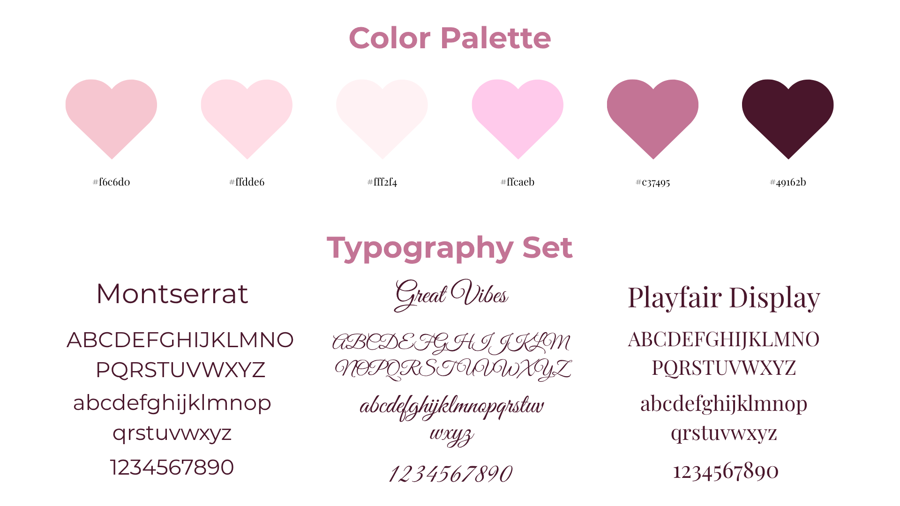
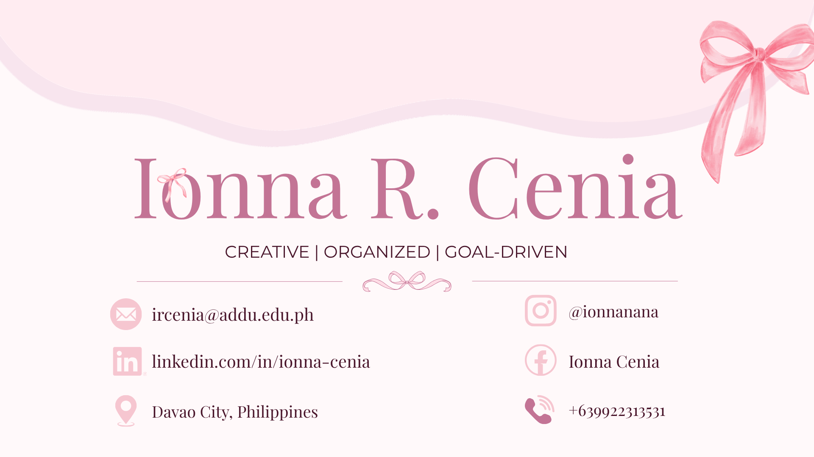
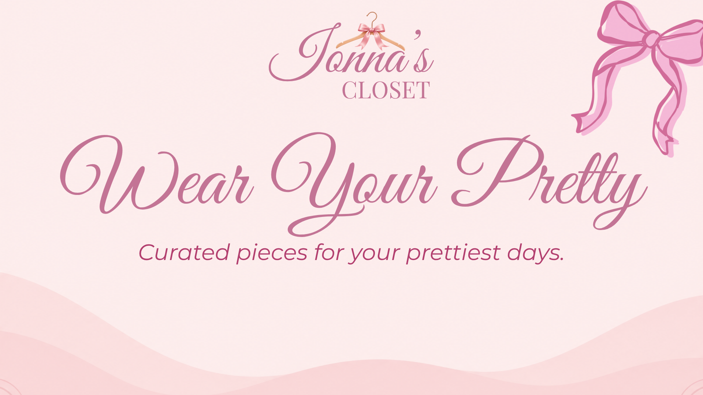
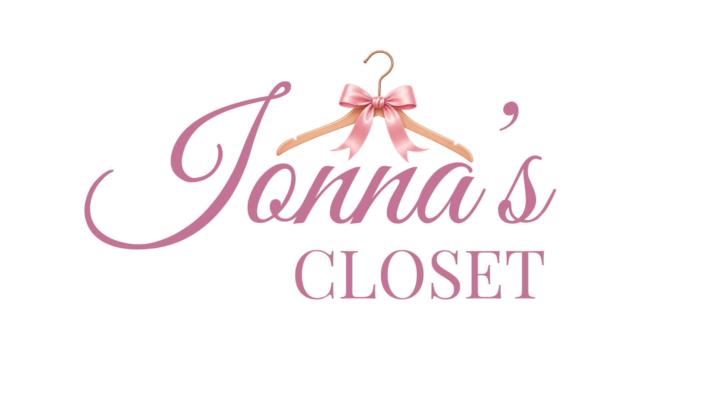

 

# 🎀 COLOR PALETTE & TYPOGRAPHY

### GE 4120 · Presentation Design Portfolio

  

🩷 ─────────── 🎀 ─────────── 💜

 

 

This activity focuses on the importance of **color palette and typography** in creating a strong and consistent visual identity. I explored how colors, fonts, spacing, and decorative elements can work together to communicate personality and create a visually pleasing design.

For this activity, I created a **color palette and typography set**, a **resume header**, a **personal tagline design**, and a **personal logo**. These outputs allowed me to apply the same visual identity across different types of designs.

My chosen style is **soft, feminine, elegant, and organized**, using different shades of pink together with burgundy and complementary typefaces.

 

---

  

🩷 ˚₊‧♡‧₊˚ 💜 ˚₊‧♡‧₊˚ 🩷

  

 

## 🩷 01 · Color Palette

I selected a palette composed mainly of **soft pink, blush, dusty rose, and deep burgundy tones**. I wanted the colors to create a feminine and elegant appearance while still maintaining enough contrast for readability.

The lighter pink shades provide a soft and welcoming background, while the darker burgundy gives the design stronger emphasis and visual contrast.

 

 

 

### ✦ Why I Chose These Colors

I chose these colors because they reflect the visual style I wanted to communicate: **soft, feminine, elegant, creative, and sophisticated**.

The combination of light and dark shades also allows me to create contrast without using colors that feel too harsh. The pink shades create warmth and personality, while the burgundy provides depth and improves readability.

 

> 🩷 *My color palette creates a visual identity that feels feminine, elegant, and uniquely personal.*

---

 

## 💜 02 · Typography Set

For my typography set, I selected **Montserrat, Great Vibes, and Playfair Display**. Each typeface has a different role, allowing me to create contrast while maintaining a consistent visual identity.

 

### 🩷 Montserrat

**Montserrat** is used for clean and readable information. Its modern and simple appearance makes it suitable for headings, labels, supporting information, and professional content.

I selected Montserrat because it gives the design a **modern and organized appearance**.

 

 

### 💜 Great Vibes

**Great Vibes** is a decorative script typeface that adds a feminine and elegant personality to the design.

I used it for more expressive elements because its flowing letterforms create a **graceful and creative feeling**.

 

 

### 🩷 Playfair Display

**Playfair Display** is a classic serif typeface that adds sophistication and elegance.

I selected it because it creates a strong contrast with Montserrat and complements the decorative style of Great Vibes.

 

 

### ✦ Why I Chose These Fonts

The three typefaces have different purposes:

**Montserrat** provides clarity and readability.

**Great Vibes** provides personality and femininity.

**Playfair Display** provides elegance and sophistication.

Together, they create a balanced combination of **modern, decorative, and classic typography**.

 

> ♡ *The right combination of typefaces can make a design feel both personal and professional.*

---

  

# RESUME HEADER

 

 

## 🩷 03 · Resume Header Design

For my resume header, I applied my chosen **pink color palette and typography system** to create a personal and professional visual identity.

The design uses my name as the main focal point. The large typography establishes **visual hierarchy**, while the smaller supporting information provides additional details without competing with the main title.

 

### ✦ Design Choices

**Color**

The soft pink background creates a gentle and approachable appearance, while the darker text provides contrast and readability.

**Typography**

The elegant serif and decorative elements give the header personality, while the clean supporting text keeps it professional.

**Decorative Elements**

The bows and thin lines add visual interest while maintaining a simple and organized composition.

**Hierarchy**

My name is the largest element because it is the most important information. Supporting details are smaller and arranged around the main title.

 

 

> 🎀 *A resume can be professional while still reflecting the personality of its creator.*

---

  

# PERSONAL TAGLINE

 

 

## 💜 04 · Tagline Design

My personal tagline is:

# **CREATIVE | ORGANIZED | GOAL-DRIVEN**

The tagline represents three qualities that I want to communicate through my personal visual identity.

 

### 🩷 Creative

I enjoy exploring ideas and expressing them through visual design. Creativity allows me to experiment with colors, typography, layouts, and different forms of visual communication.

### 💜 Organized

I value structure and clarity. I believe that good design should not only look attractive but should also present information in an organized and understandable way.

### 🩷 Goal-Driven

I approach my projects with clear objectives and continuously work toward improving the quality of my outputs.

 

 

> 🩷 *My tagline represents how I approach creativity, organization, and personal growth.*

---

  

# PERSONAL LOGO

 

 

## 🩷 05 · Ionna's Closet Logo

For my logo design, I created **Ionna's Closet**, a feminine fashion-inspired visual identity.

The logo combines **script typography, serif typography, pink tones, and a hanger with a bow** to communicate a stylish and feminine concept.

 

### ✦ Logo Elements

**Script Typography**

The script style creates an elegant and feminine appearance. It makes the name feel personal and expressive.

**Serif Typography**

The word **CLOSET** uses a classic serif style to create structure and balance.

**Pink Color**

The pink color connects the logo with my overall visual identity and gives it a soft, youthful, and feminine personality.

**Hanger**

The hanger immediately communicates the clothing and fashion concept of the brand.

**Bow**

The bow adds a decorative element that reinforces the feminine and elegant aesthetic.

 

 

> 🎀 *The logo combines typography and visual symbols to create a recognizable identity.*

---

  

🩷 ─────────── 🎀 ─────────── 💜

 

## 🌷 06 · Creating a Consistent Visual Identity

One of the main goals of this activity was to create consistency across different designs.

The same **color palette, typography styles, decorative elements, and visual mood** were applied to my resume header, tagline, and logo.

This makes the different outputs feel connected even though they serve different purposes.

 

&nbsp; + &nbsp;

&nbsp; + &nbsp;

&nbsp; = &nbsp;

 

### ✦ My Visual Identity

My overall visual identity can be described as:

**Feminine · Elegant · Creative · Organized · Personal**

The soft pink palette creates the main visual mood, while the combination of modern, script, and serif typography creates contrast and personality.

---

 

Color and typography work together to establish the overall **tone and personality** of my designs.

The soft pink colors create a gentle and feminine atmosphere, while the deep burgundy adds contrast and sophistication. The combination of Montserrat, Great Vibes, and Playfair Display allows me to balance readability with creativity.

By giving each font a specific role and maintaining a consistent color palette, I was able to create designs that feel **connected, recognizable, and visually balanced**.

 

---

  

Through this activity, I learned that **color and typography are important parts of visual communication**, not simply decorative elements.

Choosing a specific color palette helped me establish a consistent mood and identity, while selecting different typefaces allowed me to create contrast and hierarchy.

I also learned that every design element should have a purpose. The colors should support the message, the typography should remain readable, and decorative elements should enhance rather than distract from the content.

 

> 🩷 *A strong visual identity is created when every color, typeface, and element works together with intention.*

 

🎀 ─────────── 💜 ─────────── 🎀

 

  

  

**99-093 GE 4120**

 

*Presentation Design Portfolio · 2026*

 

🩷 · 🎀 · 💜 · 🪻 · 🎀 · 💜 · 🩷

 

