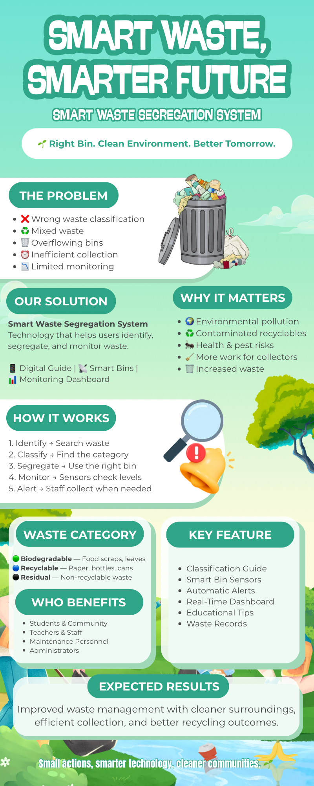

 

# 🎀 SOCIAL MEDIA INFOGRAPHICS

### GE 4120 · Presentation Design Portfolio

  

🩷 ─────────── 🎀 ─────────── 💜

 

 

This activity focuses on the creation of a **social media infographic and mini project documentation**. The project presents a concept called **“Smart Waste, Smarter Future”**, a Smart Waste Segregation System designed to encourage proper waste classification, segregation, monitoring, and collection.

The infographic combines **visual storytelling, organized information, icons, illustrations, color, typography, and layout** to communicate the concept in a simple and engaging way.

 

---

  

  

  

### SMART WASTE, SMARTER FUTURE

**Smart Waste Segregation System**

 

---

 

## 🌱 Smart Waste, Smarter Future

The project introduces a **Smart Waste Segregation System** that uses technology to help people identify, classify, segregate, and monitor waste properly.

The concept aims to promote cleaner surroundings, more efficient waste collection, improved recycling practices, and greater awareness of responsible waste management.

 

&nbsp; → &nbsp;

&nbsp; → &nbsp;

 

> 🌱 *Right Bin. Clean Environment. Better Tomorrow.*

---

 

## 🗑️ The Problem

Improper waste management can result in environmental pollution, overflowing bins, contaminated recyclables, health risks, and inefficient collection.

The infographic identifies several problems that the proposed system aims to address:

 

 

 

---

 

## 💚 Smart Waste Segregation System

The proposed solution combines technology and waste management practices to help users properly handle different types of waste.

The system provides tools that make waste segregation easier and allow waste levels and collection needs to be monitored.

 

---

 

## 🌍 Why It Matters

Proper waste segregation can contribute to a cleaner and healthier community.

The project addresses several important concerns:

- 🌎 Environmental pollution
- ♻️ Contaminated recyclables
- 🐜 Health and pest risks
- 🚛 More work for collectors
- 🗑️ Increased waste

 

---

 

## 🔍 How It Works

The Smart Waste Segregation System follows a simple process:

### 01 · Identify
Search for and identify the type of waste.

### 02 · Classify
Determine which category the waste belongs to.

### 03 · Segregate
Place the waste in the appropriate bin.

### 04 · Monitor
Smart sensors check the waste level of the bins.

### 05 · Alert
Staff are notified when collection is needed.

 

&nbsp; → &nbsp;

&nbsp; → &nbsp;

&nbsp; → &nbsp;

&nbsp; → &nbsp;

---

 

## 🌱 Waste Categories

The infographic identifies three main waste categories:

 

### 🟢 Biodegradable
Food scraps, leaves, and other organic materials.

### 🔵 Recyclable
Materials such as paper, bottles, cans, and other recyclable items.

### ⚫ Residual
Non-recyclable waste that cannot be reused or recycled.

 

---

 

## ✦ Key Features

The proposed system includes several features designed to make waste management more organized and efficient:

- 📖 Classification Guide
- 🗑️ Smart Bin Sensors
- 🔔 Automatic Alerts
- 📊 Real-Time Dashboard
- 💡 Educational Tips
- 📝 Waste Records

 

---

 

## 👥 Who Benefits

The Smart Waste Segregation System can benefit different members of the community, including:

- 🎓 Students and community members
- 👩‍🏫 Teachers and staff
- 🧹 Maintenance personnel
- 🏫 Administrators

 

> 💗 *A smart waste system can help make proper segregation easier for everyone.*

---

 

## 🎨 Visual Design Approach

For this infographic, I used a **fresh green and turquoise color palette** to communicate ideas of nature, sustainability, cleanliness, and environmental responsibility.

The rounded shapes and soft background elements create a friendly and approachable appearance, while the darker green headings provide visual structure and hierarchy.

Illustrations and icons were also incorporated to make the information easier to understand and more visually engaging.

 

  

---

 

## ✦ Design Principles Applied

### 🩷 Visual Hierarchy

Large headings such as **“SMART WASTE, SMARTER FUTURE”** immediately capture attention and introduce the main message. Section headings are also emphasized using rounded shapes and bold typography.

### 💚 Balance

Text, illustrations, icons, and colored shapes are distributed throughout the infographic to create a balanced composition.

### 🩷 Contrast

The contrast between the light background and darker green text allows important information to stand out and remain readable.

### 💚 Consistency

The repeated use of rounded containers, green headings, icons, and similar typography creates a consistent visual identity.

### 🩷 Proximity

Related information is grouped together, such as **“Our Solution,” “Why It Matters,” “Key Features,”** and **“Who Benefits.”** This makes the information easier to scan.

### 💚 Simplicity

Although the infographic contains several pieces of information, each section is presented in short statements and bullet points to prevent overwhelming the audience.

---

 

## 🌱 Expected Results

The project aims to contribute to:

- Cleaner surroundings
- More organized waste management
- More efficient waste collection
- Better recycling practices
- Improved waste segregation
- Greater environmental awareness

 

---

  

Through this activity, I learned that an infographic is more than simply combining text and images. It requires **careful planning, organization, visual hierarchy, and effective communication**.

Creating the **“Smart Waste, Smarter Future”** infographic helped me understand how information can be transformed into a visual story that is easier for an audience to read, understand, and remember.

I also learned the importance of choosing appropriate colors, typography, icons, illustrations, and layouts based on the message being communicated.

 

> 🩷 *Good infographic design turns information into a story that people can quickly understand.*

 

🎀 ─────────── 💚 ─────────── 🎀

---

# 🎀 ୨୧ SMALL ACTIONS, SMARTER FUTURE ୨୧ 🎀

 

&nbsp; → &nbsp;

&nbsp; → &nbsp;

&nbsp; → &nbsp;

  

🌱 · ♻️ · 🗑️ · 🌎 · 💚

  

### **Small actions, smarter technology, cleaner communities.**

 

  

**99-093 GE 4120**

 

*Presentation Design Portfolio · 2026*

 

🎀 ───────────────────── 🎀

 

**CREATE · DESIGN · COMMUNICATE**

 

🩷

*Designed with purpose, creativity, and a vision for a cleaner future.*

💚

 

